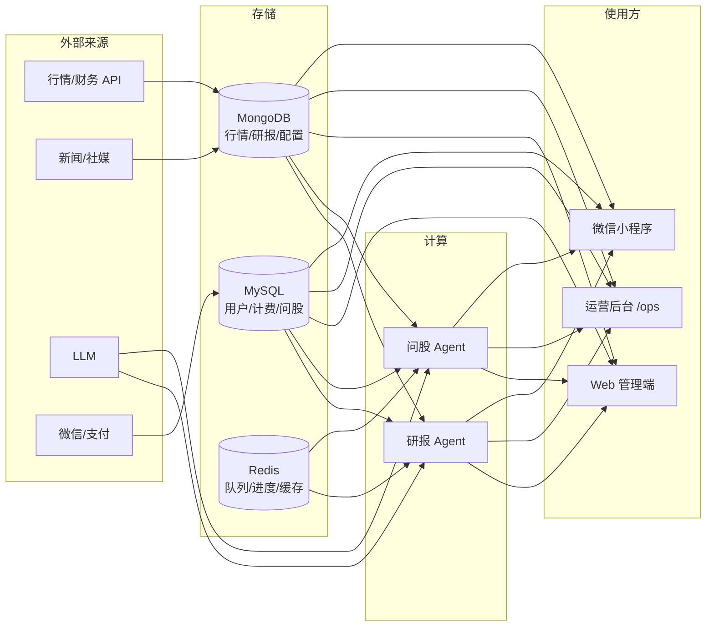
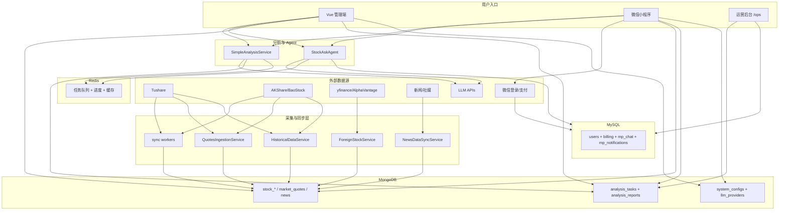

# 后台数据来源与用途说明

> 文档版本：2026-07-14  
> 适用范围：Ares 运营后台、Web 管理端、微信小程序及后端数据层

本文档按「**数据从哪来 → 存哪 → 给谁用**」梳理系统数据来源与用途，便于运维、产品与开发协作。

---

## 一、总览

系统数据大致分四层：



---

## 二、外部数据来源

### 2.1 A 股行情与基本面（定时同步 → MongoDB）

| 数据源 | 提供内容 | 主要实现 | 主要用途 |
|--------|----------|----------|----------|
| **Tushare** | 股票列表、K 线、快照、财务、新闻 | `tradingagents/dataflows/providers/china/tushare.py`<br>`app/services/data_sources/tushare_adapter.py`<br>`app/worker/tushare_sync_service.py` | 主数据源之一，定时同步入库 |
| **AKShare** | 行情（新浪/东财）、财务、新闻、行业 | `app/services/data_sources/akshare_adapter.py`<br>`app/worker/akshare_sync_service.py`<br>`app/stock_agent/data_provider/akshare_fetcher.py` | 主/备数据源；问股 Agent 也会用 |
| **BaoStock** | 基础信息、日行情、历史 K 线 | `app/services/data_sources/baostock_adapter.py`<br>`app/worker/baostock_sync_service.py` | 补充数据源 |
| **efinance** | 实时行情补充 | `app/stock_agent/data_provider/efinance_fetcher.py` | 问股 Agent 运行时按需拉取 |
| **Pytdx（通达信）** | 备用行情 | `app/stock_agent/data_provider/pytdx_fetcher.py` | 问股 Agent 备用；主数据层已移除 TDX |

**统一编排：**

- `app/services/data_sources/manager.py` — A 股多源优先级与 fallback
- `app/services/quotes_ingestion_service.py` — 全市场实时快照 → `market_quotes`
- `app/services/historical_data_service.py` — 历史 K 线 → `stock_daily_quotes`
- `app/services/multi_source_basics_sync_service.py` — 基础信息 → `stock_basic_info`
- `app/worker/financial_data_sync_service.py` — 财务 → `stock_financial_data`

**写入 MongoDB 集合：**

| 集合 | 内容 | 谁在用 |
|------|------|--------|
| `stock_basic_info` | 代码、名称、行业、PE/PB | 股票详情、筛选、分析 |
| `market_quotes` | 全市场最新快照 OHLCV | 自选股、列表、Dashboard |
| `stock_daily_quotes` | 多周期历史 K 线 | K 线图、技术分析 |
| `stock_financial_data` | 财报、估值指标 | 基本面分析 |

#### 2.1.1 Tushare 与 AKShare：更新频率

两者都有独立 APScheduler 任务（见 `app/core/config.py` / 生产 `.env`）。默认与当前生产配置一致：

| 任务类型 | Tushare | AKShare |
|----------|---------|---------|
| **盘中行情** | 工作日 09:00–15:59 **每 5 分钟**<br>`TUSHARE_QUOTES_SYNC_CRON=*/5 9-15 * * 1-5` | 工作日 09:00–15:59 **每 30 分钟**<br>`AKSHARE_QUOTES_SYNC_CRON=*/30 9-15 * * 1-5`（防限流） |
| **基础信息** | 每日 **02:00** | 每日 **03:00** |
| **历史 K 线** | 工作日 **16:00** | 工作日 **17:00** |
| **财务数据** | 周日 **03:00** | 周日 **04:00** |
| **状态检查** | 每整点 | 每小时 30 分 |

另外：

- `QuotesIngestionService` 按 `QUOTES_INGEST_INTERVAL_SECONDS` 周期性写入全市场快照到 `market_quotes`（生产约 **360 秒**），在 `tushare` / `akshare_eastmoney` / `akshare_sina` 间轮换，并对 Tushare 做小时配额限制（`QUOTES_TUSHARE_HOURLY_LIMIT`）。
- Tushare 需 `TUSHARE_TOKEN`；积分别档限流（如 `TUSHARE_TIER=standard` + `TUSHARE_RATE_LIMIT_SAFETY_MARGIN`）。成交额单位为**千元**、市值为**万元**，入库前会换算（详见 [数据源单位对比](data-sources-unit-comparison.md)）。

#### 2.1.2 Tushare 与 AKShare：使用场景

| 数据源 | 角色 | 适合场景 | 约束 |
|--------|------|----------|------|
| **Tushare** | 高质量主源之一 | 盘中较高频快照、收盘后历史/财务补齐、研报链路读库；字段规范 | 付费 Token、API 配额；单位需换算 |
| **AKShare** | 主/备数据源；问股运行时也会用 | 无/弱 Token 时兜底、Tushare 失败 fallback、东财/新浪行情补充、港股按需、行业与部分财务/新闻 | 爬虫稳定性与反爬风险更高，故行情同步更慢（30 分钟） |

选型速查：

| 场景 | 更倾向 |
|------|--------|
| 盘中相对及时的全市场快照 | Tushare（5 分钟）+ QuotesIngestion 轮换 |
| 成本优先 / 限流兜底 / 问股按需 | AKShare（定时 30 分钟 + 运行时拉取） |
| 收盘后历史、财务、基础信息 | **两者都做**，错峰（Tushare 先、AKShare 后）互补 |
| 港美股 | 不靠 Tushare 定时；港股可用 AKShare **按需** |

整体策略：**Tushare 更勤、更规范；AKShare 更慢、更自由，作备用与按需补充。**

#### 2.1.3 `DEFAULT_CHINA_DATA_SOURCE=akshare` 是否还用 Tushare？

**还用。** 该变量只影响「运行时在线读数优先找谁」，**不会**关闭 Tushare 定时同步。

| 能力线 | 受 `DEFAULT_CHINA_DATA_SOURCE` 影响？ | 当前行为（生产常设 `akshare`） |
|--------|--------------------------------------|--------------------------------|
| **运行时在线读数**（分析/适配层按需拉 API） | **是** | 先试 AKShare，失败再 fallback Tushare / BaoStock 等 |
| **后台定时同步**（`TUSHARE_*_SYNC_*`） | **否** | `TUSHARE_UNIFIED_ENABLED=true` 时基础信息/行情/K 线/财务任务仍独立跑 |
| **QuotesIngestion 快照轮换** | **否** | Tushare 仍参与轮换（受小时配额限制） |

若要基本停用 Tushare，需单独设置 `TUSHARE_ENABLED=false` 或关闭各 `TUSHARE_*_SYNC_ENABLED`，而不是只改 `DEFAULT_CHINA_DATA_SOURCE`。

研报数据层（`tradingagents/dataflows/data_source_manager.py`）中，若启用 MongoDB 缓存，**MongoDB 为最高优先级**；在线源再按配置/`DEFAULT_CHINA_DATA_SOURCE` 降级。

#### 2.1.4 双源是否都写入 Mongo？是否同一集合？如何区分来源？

**都会写入 MongoDB，且进同一批集合**（不是分表），由各自 sync worker 负责：

- Tushare：`app/worker/tushare_sync_service.py`
- AKShare：`app/worker/akshare_sync_service.py`

| 集合 | 是否同表 | 能否区分来源 | 机制 |
|------|----------|--------------|------|
| `stock_basic_info` | 是 | **能，且可并存** | 字段 `source`（`tushare` / `akshare` / …）；唯一键约 `(code, source)`。同一股票可有多条，各记各源 |
| `stock_daily_quotes` | 是 | **能，且可并存** | 字段 `data_source`；唯一键含 `(symbol, trade_date, data_source, period)` |
| `stock_financial_data` | 是 | **能，且可并存** | 字段 `data_source`；唯一键含数据源 |
| `market_quotes` | 是 | **有标记，但不按源分行** | 按 `code`/`symbol` 更新**同一条**；后写覆盖前写。`data_source` 表示**最后成功写入的来源**，不是双源各留一份 |

#### 2.1.5 读 Mongo 时是否区分来源？如何使用？

多源**入库可并存**，业务读数通常只要**一条可用结果**，因此读侧会做优先级选择，而不是把两源并排返回前端。

**读时策略：**

| 集合 | 读时是否区分 | 实际策略 |
|------|--------------|----------|
| `stock_basic_info` | **是** | `stock_data_service.get_stock_basic_info`：可显式传 `source=`；未传则按 `tushare` → `multi_source` → `akshare` → `baostock` 找第一条。部分场景（如实时 PE/PB）会硬查 `source=tushare` |
| `stock_daily_quotes` / `stock_financial_data` | **可区分** | 查询可带 `data_source` 过滤；未指定时视具体服务取数 |
| `market_quotes` | **基本不按源分行** | 按代码取最新一条快照；`data_source` 仅为写入痕迹 |

**整体链路：**

```
外部 API（Tushare / AKShare / …）
  → 定时 sync / QuotesIngestion
  → MongoDB 落地
  → Web / API / 研报 / 筛选 / 详情 优先读 Mongo
  → 没有或不足时再在线拉 API（fallback）
```

**谁在读哪张表：**

| 用途 | Mongo 集合 | 入口大致位置 |
|------|-------------|--------------|
| 名称、行业、PE/PB | `stock_basic_info` | `stock_data_service`、筛选、详情、研报 |
| 列表 / 自选现价 | `market_quotes` | Dashboard、自选、实时估值 |
| K 线 / 技术分析 | `stock_daily_quotes` | 股票详情、`historical_data_service`、分析师工具 |
| 基本面 | `stock_financial_data` | 财务分析、研报基本面 |
| 新闻 | `stock_news` | 详情、新闻分析师 |
| 条件选股 | `stock_screening_view` | `/api/screening` |
| 研报任务 / 报告 | `analysis_tasks` / `analysis_reports` | Web + 小程序 |
| 配置 / 数据源优先级 | `system_configs`、`datasource_groupings` | 配置中心 |

**读接口形态（概念）：**

```text
# 基础信息：可按源，可不传（走优先级）
get_stock_basic_info(code, source=None)
→ 未传 source：按 tushare > multi_source > akshare > baostock 找第一条

# 行情快照：不按源分行
get_market_quotes(code)
→ market_quotes 里该 code 的最新一条

# 历史 K 线：可按源过滤
get_historical_data(symbol, ..., data_source="tushare"|"akshare"|None)
```

**说明：** 小程序**问股**多数时候不走上述 Mongo 行情表，而是 Agent 运行时按需调 efinance/AKShare 等；研报 / 列表 / 详情更依赖 Mongo。

**一句话：** 写时可按源并存；读时多数业务只消费一条结果（有源字段则按优先级选；`market_quotes` 看最新覆盖结果）。业务把 Mongo 当本地行情库，缺数据再回落在线源。

---

### 2.2 港股 / 美股（按需拉取 + 缓存）

| 数据源 | 提供内容 | 模式 |
|--------|----------|------|
| **yfinance** | 港/美行情、K 线、基础信息 | 按需，缓存 10 分钟～1 天 |
| **AKShare** | 港股行情（新浪/东财） | 按需 |
| **Alpha Vantage** | 美股基本面、新闻 | API 调用 |
| **Finnhub** | 美股新闻、财报等 | 部分走本地 JSON 文件 |

**服务入口：**

- `app/services/foreign_stock_service.py` — 港/美按需拉取与缓存
- `app/services/unified_stock_service.py` — 跨市场 Mongo 集合映射（`_hk` / `_us` 后缀）

**说明：** 港股和美股已改为**按需获取 + 缓存**，不再做定时全量同步（见 `app/main.py` 注释）。

---

### 2.3 新闻与社媒

| 数据源 | 提供内容 | 存储 | 用途 |
|--------|----------|------|------|
| Tushare / AKShare 新闻 API | 个股/市场新闻 | `stock_news` | 研报、股票详情 |
| RealtimeNewsAggregator | 多源实时聚合 | `stock_news` | 定时同步（`news_data_sync_service`） |
| Google News / Reddit | 英文新闻、社媒 | 分析时在线拉取 | LangGraph 研报链路 |
| 社媒爬虫 | 微博/微信/抖音/小红书等 | `social_media_messages` | 舆情、运营查看 |

**相关服务/API：**

- `app/services/news_data_service.py` → `/api/news-data/*`
- `app/services/social_media_service.py` → `/api/social-media/*`
- `tradingagents/tools/unified_news_tool.py` — 按 A/HK/US 自动选源

---

### 2.4 LLM（大模型）

| 类型 | 来源 | 配置存储 | 用途 |
|------|------|----------|------|
| LiteLLM 多厂商 | OpenAI、DeepSeek、通义、Gemini 等 | Mongo `llm_providers` + `system_configs` | 问股、研报生成 |
| TradingAgentsGraph | 多分析师 LangGraph | 同上 | Web/小程序研报 |
| 问股 Agent | `app/stock_agent` | `.env` + Mongo 配置 | 小程序问股 SSE |

Token 消耗记录在 Mongo `token_usage`，运营可在「用量统计」页查看。

**关键文件：**

- `app/stock_agent/agent/llm_adapter.py`
- `app/services/simple_analysis_service.py`
- `app/services/stock_ask_agent_service.py`
- `tradingagents/graph/trading_graph.py`

---

### 2.5 微信与支付

| 服务 | 数据 | 存储 | 用途 |
|------|------|------|------|
| 微信登录 | openid、session | MySQL `users`（`user_type=mp_user`） | 小程序身份认证 |
| 微信支付 JSAPI | 订单、回调 | `payment_orders`、`billing_records` | 充值、扣费 |

### 2.6 外部买卖点信号 Webhook

| 接口 | 数据 | 存储 | 用途 |
|------|------|------|------|
| `POST /api/ares/signal` | 外部系统推送买点/卖点文本 | MySQL `mp_notifications`（`notice_type`: `buy_signal` / `sell_signal`） | 转为小程序全员站内信 |

**关键文件：** `app/routers/ares_signal.py`、`app/services/ares_signal_service.py`

---

## 三、存储层分工

### 3.1 MySQL（用户与商业化）

连接：`app/core/mysql_db.py`  
模型：`app/models/sql/models.py`

| 表 | 数据来源 | 用处 |
|----|----------|------|
| `users` | 注册 / 微信登录 / 运营创建 | 管理员 + 小程序用户、余额、偏好 |
| `membership_levels` | 运营配置 | 会员等级、免费额度、单价 |
| `user_quota_usage` | 计费服务按月累计 | 免费次数用量 |
| `billing_records` | 扣费 / 充值 / 调账 | 流水审计 |
| `payment_orders` | 微信支付 | 充值订单 |
| `mp_chat_sessions` / `mp_chat_messages` | 问股对话 | 问股历史、运营审核 |
| `mp_notifications` / `mp_notification_reads` | 运营发布 | 小程序站内信 |

---

### 3.2 MongoDB（行情、研报、系统配置）

连接：`app/core/database.py`

#### 行情 / 基础 / 财务（含 `_hk` / `_us` 多市场后缀）

| 集合 | 内容 | 写入来源 | 读取场景 |
|------|------|----------|----------|
| `stock_basic_info` | 代码、名称、行业、PE/PB | sync workers | 详情、筛选、分析 |
| `market_quotes` | 全市场最新快照 | `quotes_ingestion_service` | 自选股、列表 |
| `stock_daily_quotes` | 多周期历史 K 线 | `historical_data_service` | K 线图、回测 |
| `stock_financial_data` | 财报/估值指标 | `financial_data_sync_service` | 基本面分析 |
| `stock_news` | 新闻正文、情绪、来源 | `news_data_sync_service` | 详情、分析师 |

#### 分析与任务

| 集合 | 内容 | 用途 |
|------|------|------|
| `analysis_tasks` | 任务状态、进度、用户、`source`（含 `miniprogram`） | Web/小程序任务中心、运营后台 |
| `analysis_reports` | 完整研报文档、summary | 报告列表/详情 |
| `analysis_results` | 旧版结果 | 遗留，清理脚本仍引用 |

#### 配置 / 运营 / 系统

| 集合 | 内容 | 用途 |
|------|------|------|
| `system_configs` | LLM、数据源 API Key、系统设置 | 全局配置中心 |
| `datasource_groupings` | 按市场类别的数据源优先级 | 与 `system_configs` 双写同步 |
| `llm_providers` | LLM 厂商元数据、密钥 | 配置管理 UI |
| `model_catalog` | 各厂商可用模型列表 | 模型选择/过滤 |
| `token_usage` | LLM token/成本记录 | Token 统计页 |
| `sync_status` | 同步任务状态 | 多源同步 UI |
| `quotes_ingestion_status` | 实时行情入库状态 | 运维监控 |

#### 用户相关（Mongo 遗留/并存）

| 集合 | 内容 | 状态 |
|------|------|------|
| `users` | 旧用户文档 | 已迁移 MySQL，部分路径仍有写入 |
| `user_favorites` | 自选股列表 | Web 自选股主存储 |
| `user_tags` | 用户标签 | 标签服务 |
| `user_sessions` / `login_attempts` | 会话/登录尝试 | 安全/清理 |

#### 其他业务

| 集合 | 内容 | API/视图 |
|------|------|----------|
| `stock_screening_view` | 基础信息 + 行情聚合 | `/api/screening` |
| `social_media_messages` | 社媒帖子 | `/api/social-media` |
| `internal_messages` | 内部消息 | `/api/internal-messages` |
| `paper_accounts` | 模拟交易账户/持仓 | `/api/paper` |
| `operation_logs` | 操作审计 | `/api/operation-logs` |

---

### 3.3 Redis

连接：`app/core/redis_client.py`

| 键模式 | 用途 |
|--------|------|
| `user:{id}:pending` / `processing` | 用户级分析队列 |
| `global:pending` / `processing` | 全局队列 |
| `task:{id}:progress` / `result` / `lock` | 分析进度（SSE/Web/Worker） |
| `batch:{id}:*` | 批量分析 |
| `session:{id}` | 会话 |
| `rate_limit:*` / `quota:*` | 限流与配额 |
| `screening:{cache_key}` | 筛选结果缓存 |
| Pub/Sub `task_progress:{task_id}` | Worker → SSE 进度推送 |

---

## 四、运营后台（/ops）数据一览

**前端：** `frontend/src/views/Ops/*`  
**API：** `app/routers/admin_ops.py`（前缀 `/api/admin/ops`）

| 页面 | 数据来源 | 用处 |
|------|----------|------|
| **运营概览** `OpsDashboard` | MySQL 用户/账单聚合 | 充值、消费、用户概览 |
| **小程序用户** `MpUsers` | MySQL `users` | 查用户、调会员、启停 |
| **用户详情** `MpUserDetail` | MySQL `users` + 额度/账单 | 会员变更、调账、额度 |
| **会员等级** `MembershipLevels` | MySQL `membership_levels` | 定价、免费额度配置 |
| **账单流水** `BillingRecords` | MySQL `billing_records` | 扣费/充值审计 |
| **支付订单** | MySQL `payment_orders` | 微信支付对账 |
| **研报任务** `MpAnalysisTasks` | Mongo `analysis_tasks` | 监控小程序/Web 研报，可标记失败/删除 |
| **问股会话** `MpChatSessions` | MySQL `mp_chat_*` | 审核、禁用违规会话 |
| **消息通知** `MpNotifications` | MySQL `mp_notifications` | 向全体/等级/指定用户发站内信 |

---

## 五、Web 管理端（非 /ops）数据一览

| 模块 | 前端路径 | 数据来源 | 用处 |
|------|----------|----------|------|
| Dashboard | `/dashboard` | Mongo 行情 + 通知 | 看盘、快捷入口 |
| 单股/批量分析 | `/analysis/*` | Mongo 行情 + LLM + Redis | 生成研报 |
| 股票筛选 | `/screening` | Mongo `stock_screening_view` | 条件选股 |
| 自选股 | `/favorites` | Mongo `user_favorites` | 自选列表 |
| 任务中心 | `/tasks` | Mongo `analysis_tasks` + Redis | 任务进度 |
| 报告中心 | `/reports` | Mongo `analysis_reports` | 历史研报 |
| 股票详情 | `/stocks/:code` | Mongo 行情/新闻/财务 | 个股全景 |
| 模拟交易 | `/paper-trading` | Mongo `paper_accounts` | 纸面交易 |
| 配置管理 | `/settings/config` | Mongo `system_configs` 等 | API Key、LLM、数据源 |
| 多源同步 | `/settings/sync` | Sync Workers → Mongo | 手动/定时补数据 |
| 数据库管理 | `/settings/database` | Mongo 集合 | 备份、清理、统计 |
| 调度管理 | `/settings/scheduler` | APScheduler | 定时任务 |
| 缓存管理 | `/settings/cache` | Redis + 文件缓存 | 缓存运维 |
| 用量统计 | `/settings/usage` | Mongo `token_usage` | LLM 成本 |
| 操作日志 | `/settings/logs` | Mongo `operation_logs` | 审计 |

---

## 六、微信小程序数据一览

| 功能 | API 模块 | 数据来源 | 用处 |
|------|----------|----------|------|
| 微信登录 | `mp/auth.py` | 微信 API → MySQL `users` | 身份认证 |
| 个人中心 | `mp/user.py` | MySQL `users` + 额度 | 资料、余额 |
| 会员 | `mp/membership.py` | MySQL `membership_levels` | 升级/降级 |
| 研报生成 | `mp/analysis.py` | Mongo 任务 + 计费 | 提交分析 |
| 研报列表 | `mp/reports.py` | Mongo `analysis_reports` | 查看报告 |
| 问股 | `mp/chat.py` | MySQL 会话 + Agent + LLM | SSE 流式问股 |
| 站内信 | `mp/notifications.py` | MySQL `mp_notifications` | 运营消息 |
| 充值 | `mp/payment_notify.py` | 微信支付 → MySQL | 余额充值 |

---

## 七、典型数据流

### 7.1 A 股入库（后台「数据」侧）

```
Tushare / AKShare / BaoStock 定时同步（独立任务，错峰；见 §2.1.1～2.1.5）
  → stock_basic_info（按 source 可并存）
  → stock_daily_quotes / stock_financial_data（按 data_source 可并存）

QuotesIngestionService 定时快照（多源轮换，一只股票一条）
  → market_quotes

消费方：Web 列表、筛选、分析优先读 Mongo（读侧按优先级选源）；
       问股 Agent 多按需在线拉行情
```

### 7.2 小程序研报

```
用户提交
  → billing_service 计费检查（MySQL）
  → analysis_tasks（Mongo）+ Redis 队列
  → TradingAgentsGraph 读行情/新闻（Mongo + 在线 API）
  → analysis_reports（Mongo）+ billing_records（MySQL）
  → 小程序报告列表
```

### 7.3 小程序问股

```
用户提问
  → billing_service 计费检查（MySQL）
  → mp_chat_messages（MySQL）
  → 问股 Agent 按需拉行情（efinance/AKShare 等）+ LLM
  → SSE 流式返回 + 追问建议（chat_suggestion_service）
```

### 7.4 配置生效链

```
运营在「配置管理」修改
  → system_configs + llm_providers（Mongo）
  → 分析服务 / 问股 Agent 运行时读取
```

### 7.5 端到端总览



---

## 八、双轨 / 遗留 / 迁移说明

| 现象 | 说明 | 证据 |
|------|------|------|
| **Mongo → MySQL 用户/计费** | 小程序用户、会员、账单、问股、通知已迁 MySQL | `app/models/sql/models.py` |
| **Mongo `users` 残留** | 自选股仍读 `user_favorites`；部分注册路径仍写 Mongo | `favorites_service.py`、`auth_db.py` |
| **JSON 配置 → Mongo** | 旧 `config/*.json` 计划移除 | `docs/changes/DEPRECATION_NOTICE.md` |
| **TDX 移除 vs Pytdx 保留** | 主数据层无 TDX；问股 Agent 仍含 PytdxFetcher | 两套数据层并存 |
| **`datasource_groupings` ↔ `system_configs` 双写** | 改数据源优先级需同步两处 | `config_service.py` |
| **港美股定时 sync 停用** | 改为 ForeignStockService 按需 + 缓存 | `app/main.py` |
| **自选股三处** | MySQL `users.favorite_stocks` 字段存在，实际用 Mongo `user_favorites` | ORM + favorites_service |

---

## 九、关键文件速查

| 类别 | 路径 |
|------|------|
| 数据源 Provider 层 | `tradingagents/dataflows/providers/` |
| App 适配器 | `app/services/data_sources/` |
| 问股 Fetcher 层 | `app/stock_agent/data_provider/` |
| Sync Workers | `app/worker/*_sync_service.py` |
| MySQL 模型 | `app/models/sql/models.py` |
| Mongo 统一访问 | `app/core/database.py` |
| Redis | `app/core/redis_client.py` |
| 运营 API | `app/routers/admin_ops.py` |
| 小程序 API | `app/routers/mp/` |
| 分析核心 | `app/services/simple_analysis_service.py` |
| 问股 Agent | `app/stock_agent/`、`app/services/stock_ask_agent_service.py` |
| 前端 Ops | `frontend/src/views/Ops/`、`frontend/src/api/ops.ts` |
| 前端路由 | `frontend/src/router/index.ts` |
| 多市场集合对比 | `docs/architecture/database/MONGODB_COLLECTIONS_COMPARISON.md` |
| 废弃说明 | `docs/changes/DEPRECATION_NOTICE.md` |

---

## 十、相关文档

- [MongoDB 集合对比](database/MONGODB_COLLECTIONS_COMPARISON.md)
- [数据源单位对比](data-sources-unit-comparison.md)
- [数据流架构 v0.1.13](v0.1.13/data-flow-architecture.md)
- [数据源重构说明](DATA_SOURCE_REFACTOR.md)
- [配置废弃通知](../changes/DEPRECATION_NOTICE.md)
- [发送消息接口](../api/send-notification.md)

---

*本文档基于代码库现状整理，随架构演进需同步更新。*
